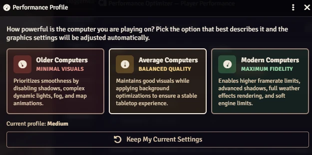
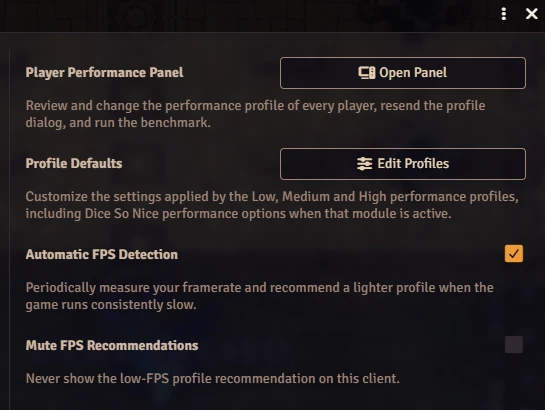
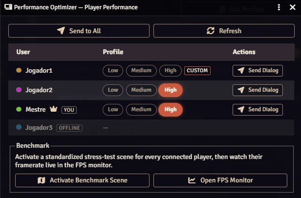
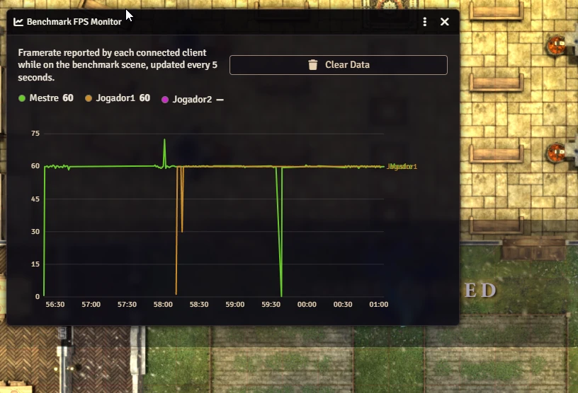
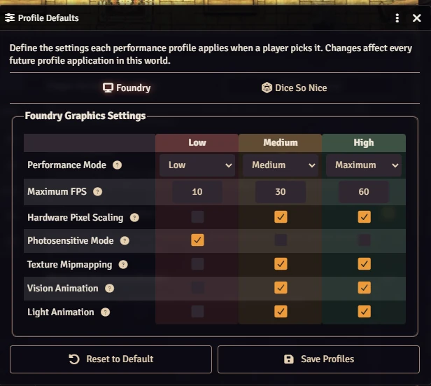

# ⚡ Performance Optimizer

A Foundry VTT module that keeps every player's game running smoothly — no matter how old or new their computer is.

[](https://buymeacoffee.com/mestredigital) [](https://mestredigital.online/pages/projetos-en)

## 🎯 What Does This Module Do?

Some players run Foundry on a gaming rig, others on an old laptop that struggles to keep up. When a low-end machine tries to render the same visual effects as a high-end one, the result is a choppy, laggy game for that player — a **smooth** experience for some, a **sluggish, overheating** one for others.

This module fixes that by letting **every player set their own performance level**, gives the **GM a remote control panel** to manage everyone's settings, and can **automatically detect and warn** players whose game is running too slow.

## ⚙️ How It Works

The first time each person logs in — players **and** the GM — a simple dialog asks them to describe their computer as **Low**, **Medium**, or **High** power. Based on that answer, the module automatically adjusts the graphics settings for that one machine only — nobody else is affected. If the game later starts running poorly, the module can notice and suggest switching to a lighter setting, entirely on that person's own machine.

## 🕹️ Features

- 🧑‍💻 **Performance Profiles** — Three ready-made presets (Low, Medium, High) that balance visual quality against speed. Each player picks the one that fits their computer.
- 🎛️ **GM Control Panel** — The GM sees which profile everyone is using — including their own machine — and can apply a different profile to any user remotely, or re-open the profile dialog for one person or the whole table at once.
- 📉 **Automatic Low-FPS Detection** — If someone's framerate stays low for a couple of minutes, the module gently suggests switching to a lighter profile. They can accept, dismiss for a day, or turn the suggestion off entirely.
- 🏁 **Benchmark & Live FPS Monitor** — The GM can load a standardized test scene and watch everyone's framerate on a live chart, making it easy to compare performance and spot who needs a lighter profile.
- 🎲 **Works With Dice So Nice** — If you use the 3D dice module, each profile also tunes the dice rendering quality, so fancy dice animations don't drag down weaker computers.

## 🖱️ Usage

**For Players:** Just answer the one-time popup honestly, and the module handles the rest. You can revisit your choice anytime from the module settings.



*The initial profile selection dialog.*



*From the module settings, anyone can reopen the profile chooser or turn the automatic FPS tips on and off.*

**For Game Masters:** You get the same one-time popup for your own machine, and you appear in the panel alongside your players. Open the **Player Performance Panel** from the Foundry settings menu to see everyone's status, change anyone's profile remotely, or run the benchmark scene to test performance across the whole table.



*The GM panel: every user's profile at a glance, with remote controls. The GM shows up too, marked "You".*

Load the benchmark scene and watch each machine's framerate live, side by side — an easy way to spot who needs a lighter profile.



*Live FPS monitor — every connected machine charted in real time.*

Advanced GMs can also fine-tune exactly what each Low/Medium/High profile changes, including the Dice So Nice options when that module is active.



*Optional: customize what each profile applies for the whole world.*

## 📦 Installation

Install via the Foundry VTT Module browser or use this manifest link:

```javascript
https://raw.githubusercontent.com/brunocalado/performance-optimizer/main/module.json
```

## ⚖️ Credits & License

* **Code License:** GNU GPLv3.

* **Demo:** The maps are from Dungeon Alchemist and are under their license: https://www.dungeonalchemist.com/terms-of-use
